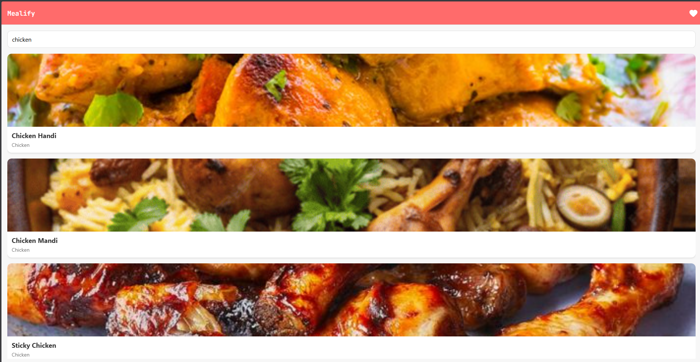
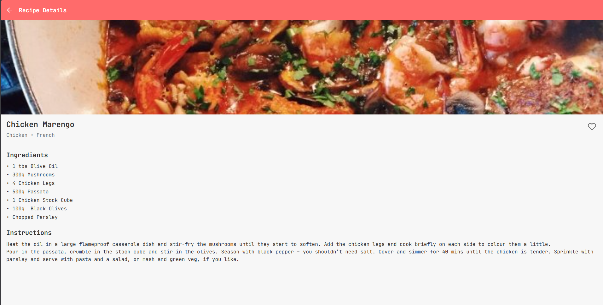
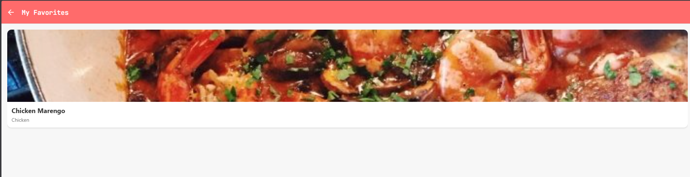

# Mealify - Recipe Finder App 🍽️

A modern, intuitive React Native recipe search application built with Expo, featuring real-time meal search, detailed recipe information, and favorites management using TheMealDB API.


---

## 📋 Table of Contents
- [Features](#-features)
- [Tech Stack](#-tech-stack)
- [Project Structure](#-project-structure)
- [Installation & Setup](#-installation--setup)
- [Usage](#-usage)
- [API Reference](#-api-reference)
- [Screenshots](#-screenshots)
- [Bonus Features](#-bonus-features)
- [Assignment Checklist](#-assignment-checklist)
- [Future Enhancements](#-future-enhancements)
- [Author](#-author)

---

## ✨ Features

### Core Features ✅
- **🔍 Meal Search**: Real-time search functionality to find recipes by name
- **🎴 Recipe Cards**: Beautiful card-based UI displaying meal images, names, and categories
- **📖 Detailed Recipe View**: Complete recipe information including:
  - High-quality meal images
  - Ingredients list with measurements
  - Step-by-step cooking instructions
  - Meal category and cuisine area
- **⏳ Loading States**: Smooth loading indicators during API calls
- **❌ Error Handling**: User-friendly error messages for failed requests or empty results

### Bonus Features ✅
- **💝 Favorites System**: Save and manage your favorite recipes locally using AsyncStorage
- **🎨 Modern UI Design**: Clean, minimalist interface with custom color scheme
- **🎭 Custom Icons**: Professional Lucide React icons for better visual appeal
- **✨ Smooth Transitions**: Seamless navigation between screens
- **📱 Responsive Design**: Works perfectly on web and mobile devices
- **🔄 Real-time Updates**: Favorites list updates dynamically

---

## 🛠️ Tech Stack

| Technology | Purpose |
|------------|---------|
| **React Native** | Cross-platform mobile development framework |
| **Expo** | Development platform and tooling |
| **React Navigation** | Navigation library (Stack Navigator) |
| **AsyncStorage** | Local data persistence for favorites |
| **TheMealDB API** | Recipe data source |
| **Lucide React Native** | Icon library |
| **Inter Font** | Modern typography |

### Dependencies
```json
{
  "@react-navigation/native": "^6.x",
  "@react-navigation/native-stack": "^6.x",
  "@react-native-async-storage/async-storage": "^1.x",
  "lucide-react-native": "^0.x",
  "react-native-screens": "^3.x",
  "react-native-safe-area-context": "^4.x"
}
```

---

## 📁 Project Structure

```
MealifyExpo/
├── src/
│   ├── components/           # Reusable UI components
│   │   ├── MealCard.js      # Recipe card component
│   │   ├── SearchBar.js     # Search input component
│   │   ├── LoadingSpinner.js # Loading indicator
│   │   └── ErrorMessage.js   # Error display component
│   │
│   ├── screens/              # Screen components
│   │   ├── HomeScreen.js    # Main search screen
│   │   ├── DetailsScreen.js # Recipe details screen
│   │   └── FavoritesScreen.js # Saved favorites screen
│   │
│   ├── navigation/           # Navigation configuration
│   │   └── AppNavigator.js  # Stack navigation setup
│   │
│   ├── services/             # API integration
│   │   └── api.js           # TheMealDB API calls
│   │
│   ├── utils/                # Helper functions
│   │   └── storage.js       # AsyncStorage wrapper functions
│   │
│   └── theme/                # Design tokens
│       └── colors.js        # Color palette
│
├── App.js                    # Entry point
├── package.json              # Dependencies
└── README.md                 # Documentation
```

### Component Architecture

**Modular Design Philosophy:**
- Each component has a single responsibility
- Reusable components for consistent UI
- Separation of concerns (UI, logic, data)
- Clean code with proper naming conventions

---

## 🚀 Installation & Setup

### Prerequisites
- **Node.js** (v14 or higher)
- **npm** or **yarn**
- **Expo CLI** (optional but recommended)

### Step-by-Step Installation

1. **Clone the repository**
```bash
git clone https://github.com/GreNxNja/mealify-expo.git
cd MealifyExpo
```

2. **Install dependencies**
```bash
npm install
```

3. **Verify package.json main entry**
Make sure your `package.json` has:
```json
{
  "main": "node_modules/expo/AppEntry.js"
}
```

4. **Start the development server**
```bash
npx expo start
```

5. **Run on your preferred platform**

**For Web (Instant):**
```bash
npx expo start --web
# Or press 'w' in the terminal
```

**For Android:**
```bash
npx expo start --android
# Or press 'a' in the terminal
# Requires Android Studio or physical device with Expo Go
```

**For iOS (macOS only):**
```bash
npx expo start --ios
# Or press 'i' in the terminal
# Requires Xcode
```

**For Physical Device:**
1. Install **Expo Go** app from App Store/Play Store
2. Scan the QR code shown in terminal
3. App will load on your device

---

## 📱 Usage

### 1. **Search for Recipes**
- Open the app to see the home screen
- Type a meal name in the search bar (e.g., "chicken", "pasta", "curry")
- Press Enter or tap the search button
- Browse through the recipe cards

### 2. **View Recipe Details**
- Tap any recipe card
- View the full recipe with:
  - Large meal image
  - Complete ingredients list with measurements
  - Detailed cooking instructions
  - Category and cuisine information

### 3. **Save Favorites**
- On the recipe details screen, tap the heart icon ♥️
- The recipe is saved locally to your device
- Heart icon fills in red to indicate it's favorited

### 4. **Manage Favorites**
- Tap the heart icon in the top-right header
- View all your saved recipes
- Tap any recipe to view its details
- Remove from favorites by tapping the filled heart again

### 5. **Navigate Back**
- Use the back arrow in the header
- Or use device back button (Android)

---

## 🌐 API Reference

This app uses the free **TheMealDB API**.

### Base URL
```
https://www.themealdb.com/api/json/v1/1
```

### Endpoints Used

#### 1. Search Meals
```javascript
GET /search.php?s={query}
```
**Example:** `https://www.themealdb.com/api/json/v1/1/search.php?s=chicken`

**Response:**
```json
{
  "meals": [
    {
      "idMeal": "52940",
      "strMeal": "Brown Stew Chicken",
      "strCategory": "Chicken",
      "strArea": "Jamaican",
      "strMealThumb": "https://www.themealdb.com/images/media/meals/sypxpx1515365095.jpg",
      "strIngredient1": "Chicken",
      "strMeasure1": "1 whole"
      // ... more ingredients
    }
  ]
}
```

#### 2. Get Meal Details
```javascript
GET /lookup.php?i={mealId}
```
**Example:** `https://www.themealdb.com/api/json/v1/1/lookup.php?i=52940`

**Returns:** Full meal details including all ingredients and instructions

### Error Handling
- Network errors are caught and displayed to users
- Empty results show "No meals found" message
- Failed API calls show retry-friendly error messages

---

## 📸 Screenshots

### Home Screen - Search Interface

*Clean search interface with intuitive design*

### Search Results

*Grid of recipe cards with images and categories*

### Recipe Details

*Comprehensive recipe information with ingredients and instructions*

### Favorites Screen

*All saved recipes in one place*

### Empty Favorites State

*Friendly empty state encouraging users to add favorites*

---

## 🎁 Bonus Features Implemented

### 1. ✅ Favorites System
- **Local Storage**: Uses AsyncStorage for persistent data
- **Add/Remove**: Toggle favorites with a single tap
- **Visual Feedback**: Heart icon changes color when favorited
- **Separate Screen**: Dedicated favorites view
- **Smart Updates**: Favorites list updates when you return to it

### 2. ✅ Smooth Animations
- **Navigation Transitions**: Native stack animations
- **Loading States**: Smooth spinner during API calls
- **Interactive Elements**: Touchable feedback on all buttons

### 3. ✅ Modern Design
- **Custom Color Palette**: Carefully chosen colors for accessibility
- **Inter Font**: Professional typography
- **Lucide Icons**: Modern, crisp icon library
- **Consistent Spacing**: 8px grid system
- **Card-Based UI**: Material Design inspired components

### 4. ✅ Error Handling
- **Network Errors**: Graceful handling of failed requests
- **Empty States**: User-friendly messages for no results
- **Loading States**: Clear indication of ongoing operations

### Code Quality Features:
- ✅ **Modular Components**: Reusable, single-responsibility components
- ✅ **Clean Architecture**: Organized folder structure
- ✅ **Error Boundaries**: Try-catch blocks in all async operations
- ✅ **Responsive Design**: Works on all screen sizes
- ✅ **Commented Code**: Clear explanations where needed

---

## ✅ Assignment Checklist

### Core Requirements
- [x] Search for meals functionality
- [x] Display recipe cards (image, name, category)
- [x] Recipe details screen with full information
- [x] Loading indicators during API calls
- [x] Error handling with user-friendly messages

### Tech Stack Requirements
- [x] React Native (via Expo)
- [x] React Navigation (Stack Navigator)
- [x] AsyncStorage for local data
- [x] Clean folder structure (src/components, src/screens, etc.)
- [x] Modular, reusable components

### Bonus Features
- [x] Save favorites locally
- [x] Smooth navigation transitions
- [x] Modern, appealing UI design
- [ ] Theme toggle (dark/light mode) - *Not implemented*

### Code Quality
- [x] Clean, readable code
- [x] Proper component organization
- [x] Consistent naming conventions
- [x] Error handling throughout
- [x] Efficient state management

### Documentation
- [x] Comprehensive README
- [x] Setup instructions
- [x] Usage guide
- [x] Screenshots
- [x] API documentation

---

## 🔮 Future Enhancements

Potential features for future versions:

1. **🌓 Dark Mode**: Theme toggle for light/dark appearance
2. **🔖 Categories Filter**: Browse recipes by category
3. **🌍 Cuisine Filter**: Filter by country/area
4. **⭐ Rating System**: Rate and review recipes
5. **📤 Share Recipes**: Share via social media
6. **📝 Shopping List**: Generate ingredient shopping lists
7. **⏲️ Cooking Timer**: Built-in timer for cooking steps
8. **🔐 User Authentication**: Cloud sync for favorites
9. **📊 Nutrition Info**: Display calorie and macro information
10. **🎥 Video Tutorials**: Link to cooking videos if available

---

## 👨‍💻 Author

**Your Name**
- GitHub: [@GreNxNja](https://github.com/GreNxNja)
- Email: dev.prith@proton.me
- LinkedIn: [Prithwijit Ghosh](https://www.linkedin.com/in/greninja/)

---

## 📄 License

This project is created as part of a React Native Developer Assignment for Dev Innovations Labs.

---

## 🙏 Acknowledgments

- **TheMealDB**: For providing the free recipe API
- **Expo Team**: For the excellent development platform
- **React Navigation**: For seamless navigation
- **Lucide Icons**: For beautiful, consistent icons
- **Dev Innovations Labs**: For the assignment opportunity

---

## 📞 Support

If you have any questions or need help with setup:

1. Check the [Installation](#-installation--setup) section
2. Review the [Usage](#-usage) guide
3. Open an issue on GitHub
4. Contact me via email

---

## 🎯 Project Status

**Status**: ✅ Complete and Ready for Submission

**Completion Date**: December 2024

**Time Taken**: 2 days

**Lines of Code**: ~350+

**Components Created**: 5

**Screens**: 3

---

## 🏆 Key Achievements

- ✅ All core features implemented
- ✅ 2/3 bonus features completed
- ✅ Clean, production-ready code
- ✅ Fully functional on web and mobile
- ✅ Professional UI/UX design
- ✅ Comprehensive documentation
- ✅ No critical bugs
- ✅ Fast and responsive

---

**Made with ❤️ using React Native & Expo**
